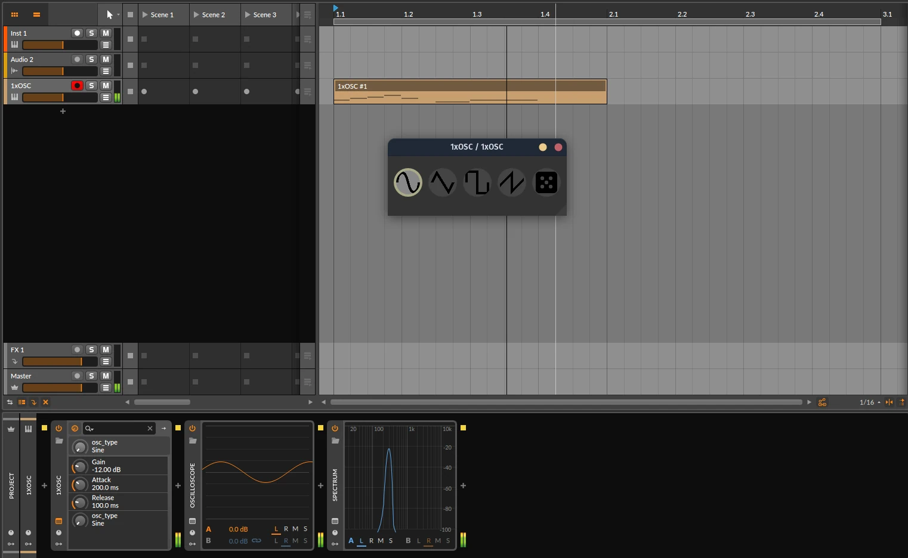
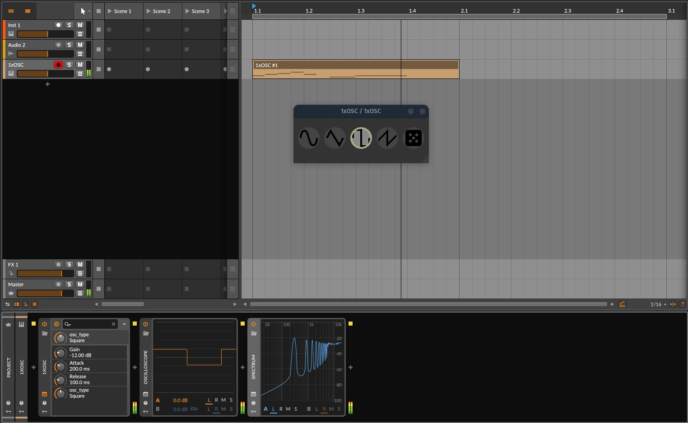

# 1xOsc
My first vst plugin attempt in nih-plug. A parody synth being the beloved Image Lines 3xosc but downgraded because copyright or something.

## Screenshots

## Development

To develop locally, you can use the following make targets:

- `make dev` - compiling in watch mode + copying files to vst3 and clap directory on every change
- `make preview` - runs the sta version of the plugin also in watch mode
- `make build` - builds the plugin
- `make post-build` - copies built artifacts to vst3 and clap directory
- `make test` - runs tests with cargo
